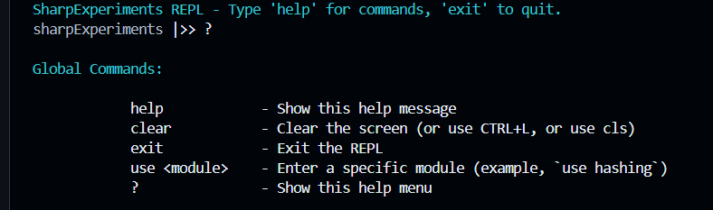
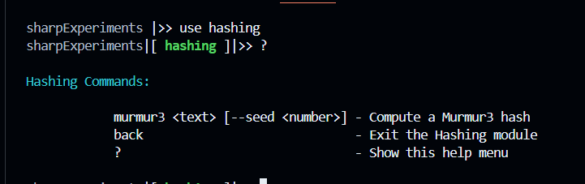
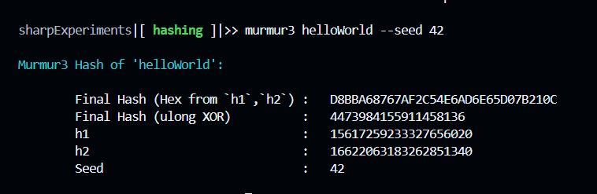
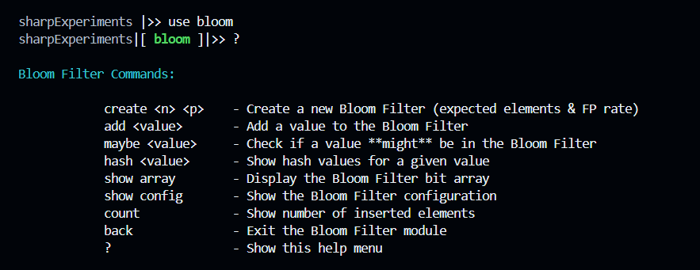
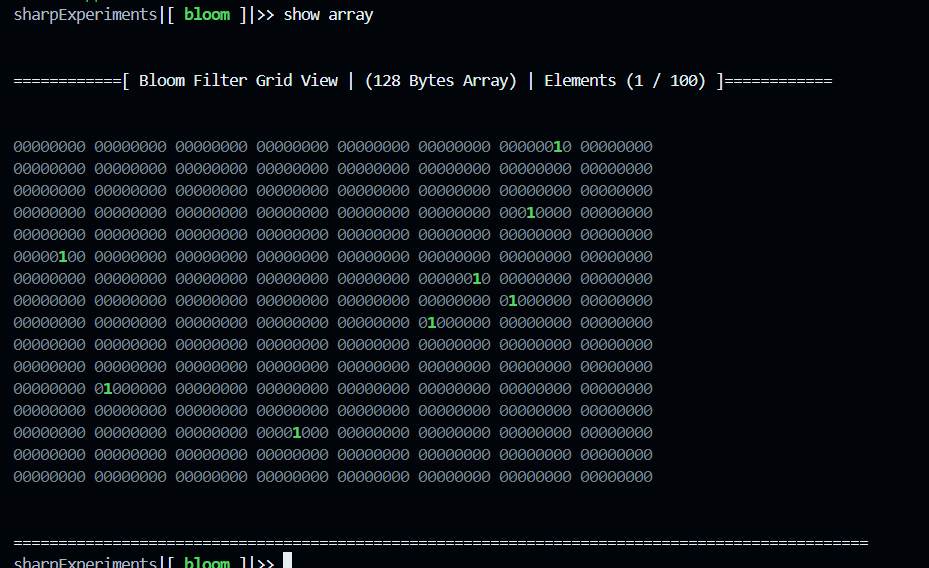

# About

This is an instructional resource in `C#` used in voluntary work with academic insitutions.  The goal is to provide practical lectures using `C#` with computer science topics. It is also, a personal project for me to learn modern `C#` given its popular growth across development platforms - i.e., `linux|macos|windows`.

<br/><br/>

## How to Use
A repl is provided to explore the experiments, and with a nodejs helper through `package.json` anyone can run the following command:

```bash
npm run repl
```

<br/>

### REPL
The REPL is expected to host the experiments, and every command can use `?` for help menu options.

#### Using Experiment Modules

```
sharpExperiments|>> use {{ module name here}}
```



<br/><br/>

##### Hashing Module
The hashing module exposes experiments where well-known `hashing functions` are ported into `C#`, for example `murmur3`.



<br/><br/>

An example of running the experiment of the `murmur3` hashing function against a string.



<br/><br/>

##### Bloom Module (Bloom Filters)
The `bloom` module, allows students to learn about `bloom filters`.



<br/>

Creating a (SBF) Standard Bloom Filter with 100 elements and a `0.8%` false positive threshold

```bash
sharpExperiment|[ bloom ]|>> create 100 0.008
```

<br/>

Adding an item called `apples` to the bloom filter.

```bash
sharpExperiment|[ bloom ]|>> add apples
```

<br/>

Showing a Murmur3 hash for `apples` that would be used by the bloom filter.

```bash
sharpExperiment|[ bloom ]|>> hash apples

Hash values for "apples":
  -> h1   : 1930194799263898699
  -> h2   : 8892033558939334954
  -> h3   : 517159381130312880
  -> h4   : 3138041090577958966
  -> h5   : 8713243961885827284
  -> h6   : 220221194916942134
  -> h7   : 4933528259806730540
  -> h8   : 4341087514715210830
```

<br/>

Checking if the `apples` item is a member of the bloom filter.

```bash
sharpExperiment|[ bloom ]|>> maybe apples

🔎 Checking membership for "apples":
✅ apples is **possibly present** in the filter.
```

<br/>

Visually understanding the bloom filter's state 


